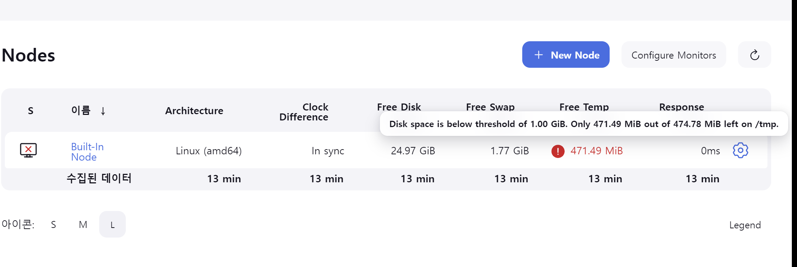
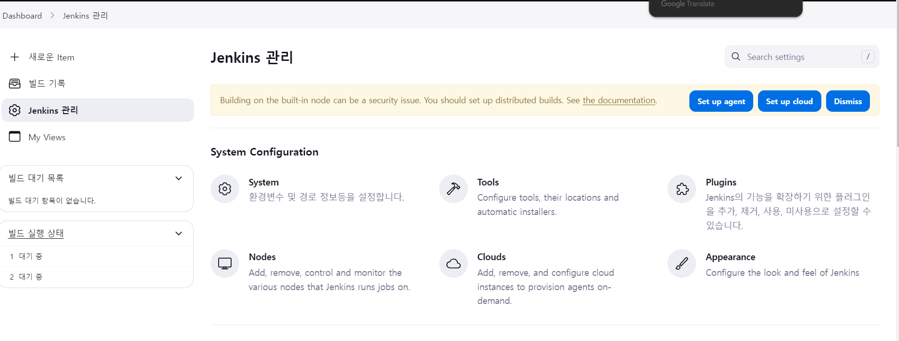
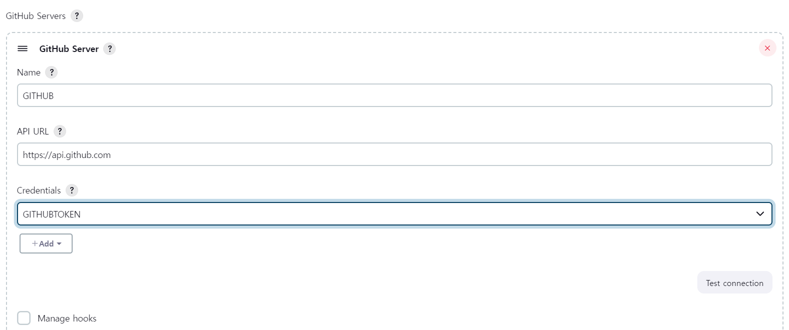

01_TMP_ERROR
---
> /etc/profile 수정 -> /etc/fstab 에서 수정으로 변경할것(적용시간차에 의한 문제)
```
vi /etc/fstab
tmpfs   /tmp    tmpfs   size=5g,mode=1777   0   0
:wq

mount -a 
```
|-|
|-|
| |
| |
| |
| |
| |
| |
| |
| |

---
#
---

02_SYSTEM
---
> <br>

|-|
|-|
| |
| |
| |
| |
| |
| |
| |
| |
| |
| |
| |
| |
| |
| |
| |
| |
| |
| |
| |
| |
| |
| |


---
#
---

03_TOOLES
---
> <br>

|-|
|-|
| |
| |
| |
| |
| |
| |
| |
| |
| |
| |

---
#
---

04_PLUGINS
---
> <br>

|-|
|-|
| |
| |
| |
| |
| |
| |

---
#
---

05_PROJECTS
---
> <br>

|-|
|-|
| |
| |
| |
| |
| |
| |
| |
| |
| |
| |
| |
| |
| |
| |
| |
| |
| |
| |
| |
| |

> RESULT <br>

```
Started by user jungwoogyun
Running as SYSTEM
Building in workspace /var/lib/jenkins/workspace/DEPLOYTEST
The recommended git tool is: NONE
No credentials specified
Cloning the remote Git repository
Cloning repository https://github.com/jungwoogyun/DEPLOYTEST.git
 > git init /var/lib/jenkins/workspace/DEPLOYTEST # timeout=10
Fetching upstream changes from https://github.com/jungwoogyun/DEPLOYTEST.git
 > git --version # timeout=10
 > git --version # 'git version 2.40.1'
 > git fetch --tags --force --progress -- https://github.com/jungwoogyun/DEPLOYTEST.git +refs/heads/*:refs/remotes/origin/* # timeout=10
 > git config remote.origin.url https://github.com/jungwoogyun/DEPLOYTEST.git # timeout=10
 > git config --add remote.origin.fetch +refs/heads/*:refs/remotes/origin/* # timeout=10
Avoid second fetch
 > git rev-parse refs/remotes/origin/main^{commit} # timeout=10
Checking out Revision 0ce0305f15d64d7020e64d6ba9c8c1162d2c403c (refs/remotes/origin/main)
 > git config core.sparsecheckout # timeout=10
 > git checkout -f 0ce0305f15d64d7020e64d6ba9c8c1162d2c403c # timeout=10
Commit message: "."
First time build. Skipping changelog.
[Gradle] - Launching build.
Unpacking https://services.gradle.org/distributions/gradle-8.7-bin.zip to /var/lib/jenkins/tools/hudson.plugins.gradle.GradleInstallation/GRADLE8_7 on Jenkins
[DEPLOYTEST] $ /var/lib/jenkins/tools/hudson.plugins.gradle.GradleInstallation/GRADLE8_7/bin/gradle clean build

Welcome to Gradle 8.7!

Here are the highlights of this release:
 - Compiling and testing with Java 22
 - Cacheable Groovy script compilation
 - New methods in lazy collection properties

For more details see https://docs.gradle.org/8.7/release-notes.html

Starting a Gradle Daemon (subsequent builds will be faster)
> Task :clean UP-TO-DATE
> Task :compileJava
> Task :processResources
> Task :classes
> Task :resolveMainClassName
> Task :bootJar
> Task :jar
> Task :assemble
> Task :compileTestJava
> Task :processTestResources NO-SOURCE
> Task :testClasses
OpenJDK 64-Bit Server VM warning: Sharing is only supported for boot loader classes because bootstrap classpath has been appended
> Task :test
> Task :check
> Task :build

BUILD SUCCESSFUL in 1m 42s
8 actionable tasks: 7 executed, 1 up-to-date
Build step 'Invoke Gradle script' changed build result to SUCCESS
Performing Post build task...
Could not match :SUCCESS_  : False
Logical operation result is FALSE
Skipping script  : #!/bin/bash

# 프로세스를 실행한 Java 명령어와 JAR 파일 경로를 지정합니다.
JAVA_COMMAND="java -jar"
JAR_PATH="/var/lib/jenkins/workspace/DEPLOYTEST/build/libs/app-0.0.1-SNAPSHOT.jar"

# 해당 Java 프로세스를 찾아서 PID를 얻어냅니다.
TARGET_PID=$(pgrep -f "$JAVA_COMMAND $JAR_PATH")

# PID를 확인하고 종료합니다.
if [ -z "$TARGET_PID" ]; then
    echo "해당 프로세스가 이미 종료되었습니다."
else
    echo "프로세스 $TARGET_PID 종료 중..."
    kill -9 "$TARGET_PID"

    # 종료 후 확인
    if ps -p "$TARGET_PID" > /dev/null; then
        echo "프로세스 $TARGET_PID 종료 실패"
        # exit 1
    else
        echo "프로세스 $TARGET_PID 성공적으로 종료됨"
    fi
fi

nohup java -jar /var/lib/jenkins/workspace/DEPLOYTEST/build/libs/app-0.0.1-SNAPSHOT.jar &

END OF POST BUILD TASK 	: 0
Finished: SUCCESS
```
---
#
---

06_DEPLOYTEST_01
---
> <br>

|-|
|-|
| |

---
#
---

07_DEPLOYTEST_02
---
> <br>

|-|
|-|
| |

---
#
---


