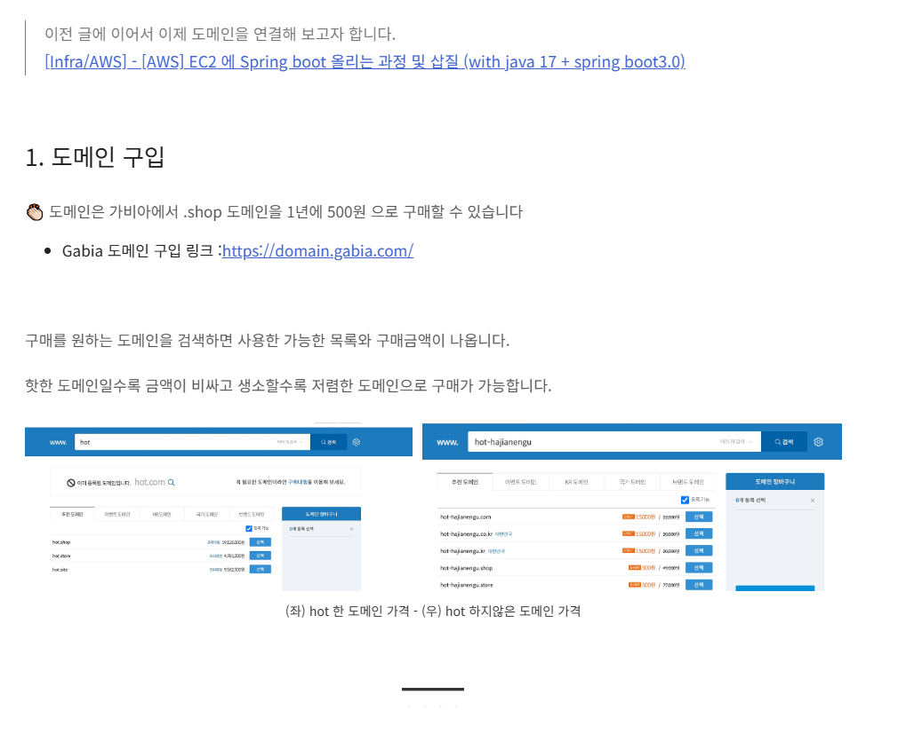
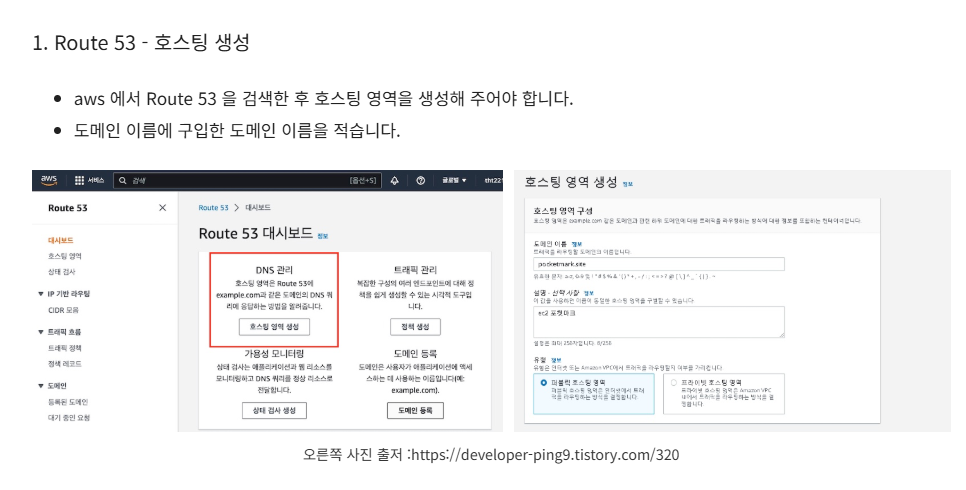
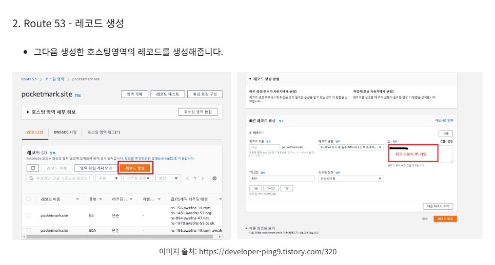
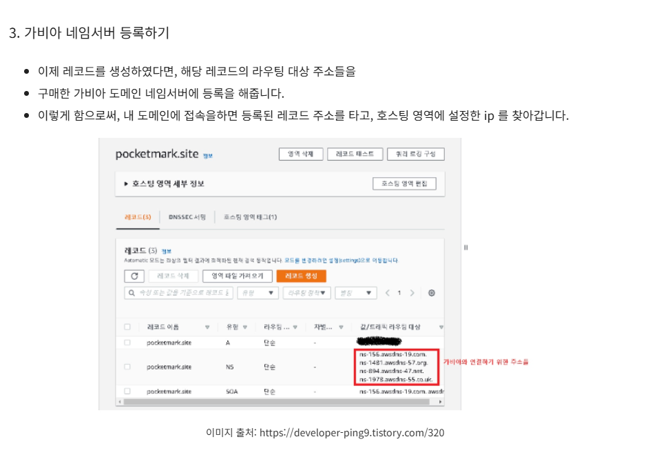
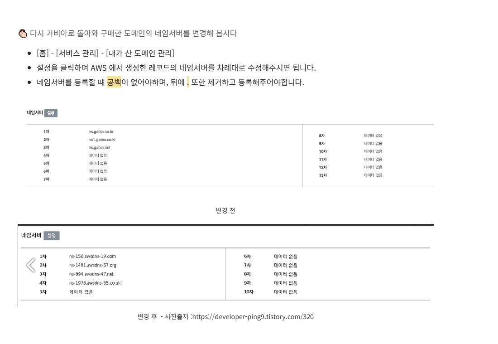
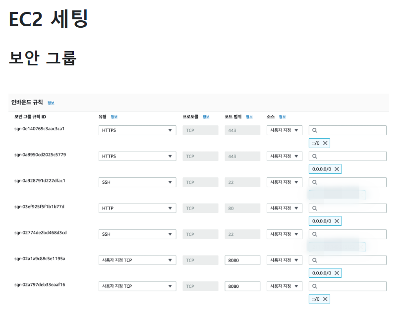
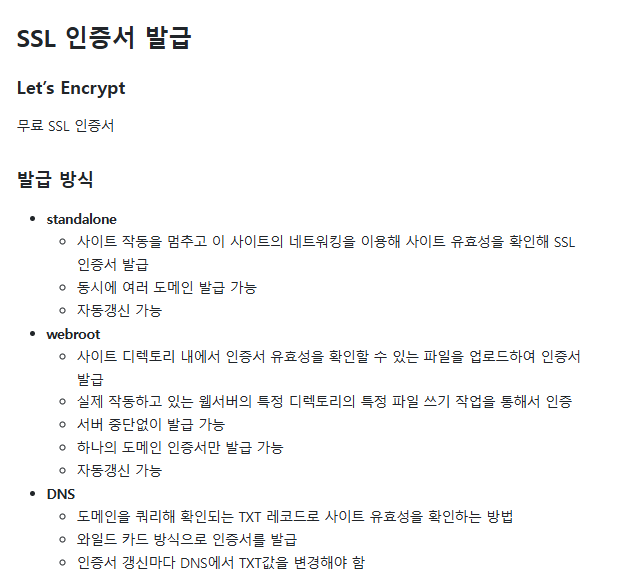
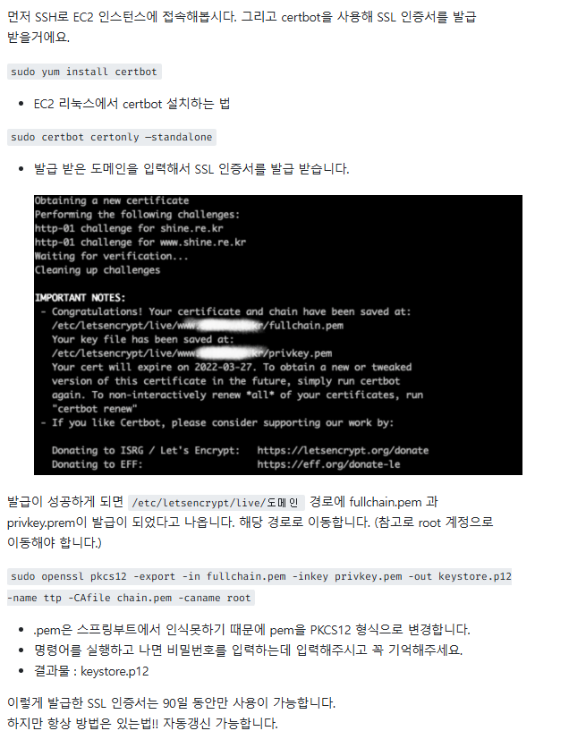
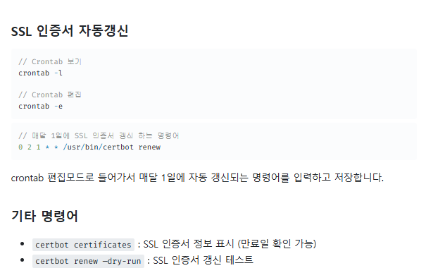
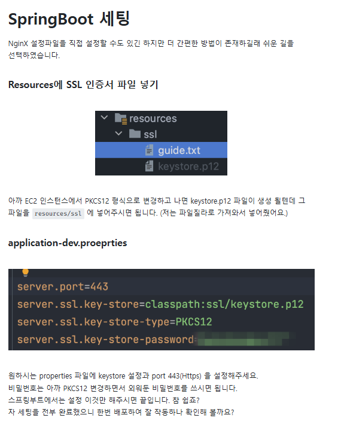

---
참고
---

|-|-|
|-|-|
|도메인연결|[바로가기](https://thalals.tistory.com/409)|
|인증서(HTTPS)적용하기|[바로가기](https://velog.io/@boo105/SpringBoot%EC%97%90-SSL-%EC%9D%B8%EC%A6%9D%EC%84%9C%EB%A5%BC-%EC%A0%81%EC%9A%A9%ED%95%B4%EB%B3%B4%EC%9E%90)|

---
가비아도메인 AWS ROUTER 연결
---

|-|-|
|-|-|
||-|
||-|
||-|
||-|
||-|

> SPRINGBOOT 인증서 적용

|-|-|
|-|-|
||-|
||-|
||-|
||-|
||-|

---
Embed Tomcat 권한 부족 동작실패 오류 처리 - AWS EC2 JENKINS 권한 상승처리
---
```
vi /etc/sudoers

101 jenkins ALL=(ALL)       NOPASSWD:ALL

:wq
```
---
Embed Tomcat 권한 부족 동작실패 오류 처리 - JENKINS POST TASK SCRIPT CODE 변경
---
```
#!/bin/bash

# 특정 프로세스의 PID 찾기
PID=$(ps aux | grep 'java -jar /var/lib/jenkins/workspace/TEST/build/libs/demo-0.0.1-SNAPSHOT.jar' | grep -v grep | awk '{print $2}')

# PID가 존재하는지 확인
if [ -n "$PID" ]; then
    # PID가 있으면 프로세스 종료
    echo "프로세스 종료 중... PID: $PID"
    sudo kill $PID
    echo "프로세스가 종료되었습니다."
else
    # PID가 없으면 메시지 출력
    echo "종료할 프로세스가 없습니다."
fi

sudo nohup java -jar /var/lib/jenkins/workspace/TEST/build/libs/demo-0.0.1-SNAPSHOT.jar &
```
