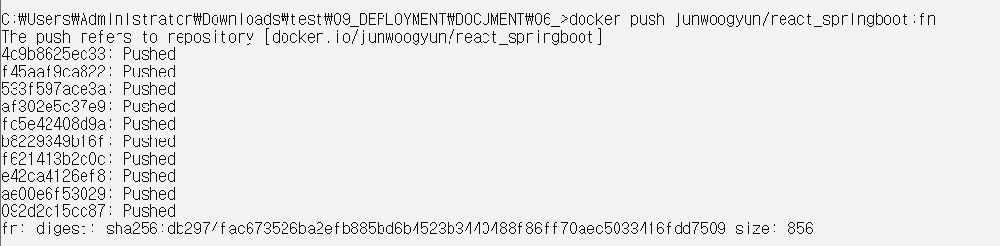

# DOCKER HUB

|-|
|-|
|[DOCKER HUB 란](https://hanmailco34.tistory.com/278)|
|[DOCKER HUB 가입하기](https://tttsss77.tistory.com/232)|


---
DOCKER IMAGE PUSH 
---

>DOCKERHUB REPO 생성

|-|
|-|
||
||
||
||
||
||


> DOCKER IMAGE TAG 변경

```
docker tag bn:latest junwoogyun/react_springboot:bn
docker tag fn:latest junwoogyun/react_springboot:fn
docker tag db:latest junwoogyun/react_springboot:db
docker tag redis:latest junwoogyun/react_springboot:redis
```
> DOCKER IMAGE TAG CHANGE

|-|
|-|
||


> DOCKER CMD LOGI

|-|
|-|
||
||
||
||
||


> DOCKER IMAGE PUSH

```
docker push junwoogyun/react_springboot:bn
docker push junwoogyun/react_springboot:fn
docker push junwoogyun/react_springboot:db
docker push junwoogyun/react_springboot:redis
```

|-|
|-|
||
||
||
||
||


---
DOCKERCOMPOSE YML 파일 수정하기
---

> docker-compose.yml 수정
```
version: "3.9"

networks:
  my-custom-network:
    driver: bridge
    ipam:
      config:
        - subnet: 192.168.1.0/24

services:
  DB:
    image: junwoogyun/react_springboot:db
    container_name: db-container
    networks:
      my-custom-network:
        ipv4_address: 192.168.1.100
    ports:
      - "3330:3306"
    healthcheck:
      test: ["CMD", "mysqladmin", "ping", "-h", "localhost"]
      interval: 10s
      timeout: 5s
      retries: 5

  redis:
    image: junwoogyun/react_springboot:redis
    container_name: redis-container
    networks:
      my-custom-network:
        ipv4_address: 192.168.1.200
    ports:
      - "6376:6376"

  BN:
    image: junwoogyun/react_springboot:bn
    container_name: bn-container
    networks:
      my-custom-network:
        ipv4_address: 192.168.1.20
    ports:
      - "8095:8095"
    depends_on:
      DB:
        condition: service_healthy
    healthcheck:
      test: ["CMD-SHELL", "curl -f http://localhost:8095 || exit 1"]
      interval: 10s
      timeout: 5s
      retries: 5

  FN:
    image: junwoogyun/react_springboot:fn
    container_name: fn-container
    networks:
      my-custom-network:
        ipv4_address: 192.168.1.10
    ports:
      - "3000:80"
    depends_on:
      BN:
        condition: service_healthy

```


---
DOCKERCOMPOSE UP TEST
---

> 기존 모든 컨테이너 & 도커 이미지 삭제
```
# 실행 중인 모든 컨테이너 중지
docker stop $(docker ps -aq)

# 모든 컨테이너 삭제
docker rm $(docker ps -aq)

# 모든 이미지 삭제
for /f "tokens=*" %i in ('docker images -q') do docker rmi -f %i
```


> docker-compose up 실행
```
C:\Users\Administrator\Downloads\test\09_DEPLOYMENT\DOCUMENT\06_>docker-compose up
time="2025-01-15T15:42:54+09:00" level=warning msg="C:\\Users\\Administrator\\Downloads\\test\\09_DEPLOYMENT\\DOCUMENT\\06_\\docker-compose.yml: the attribute `version` is obsolete, it will be ignored, please remove it to avoid potential confusion"
[+] Running 6/7
 - redis Pulling                                                                                                                                             1.8s
 - FN [⣿⣿] Pulling                                                                                                                                           1.8s
   ✔ e42ca4126ef8 Already exists                                                                                                                             0.0s   ✔ fef3cce2de10 Already exists                                                                                                               0.0s
   ✔ f621413b2c0c Already exists                                                                                                                             0.0s[+] Running 9/9911 Already exists                                                                                                               0.0s
 ✔ redis Pulled                                                                                                                                              1.9s   ✔ fef3cce2de10 Already exists                                                                                                                             0.0s   ✔ 73d410e10321 Already exists                                                                                                                             0.0s   ✔ 5ed8a1bb0b00 Already exists                                                                                                                             0.0s ✔ FN Pulled                                                                                                                                                 1.9s   ✔ 9f188c65d911 Already exists                                                                                                                             0.0s   ✔ e42ca4126ef8 Already exists                                                                                                                             0.0s ✔ DB Pulled                                                                                                                                                 1.7s[+] Running 9/100c Already exists                                                                                                                             0.0s ✔ redis Pulled                                                                                                                                              1.9s - BN [⣿⣿⣿] Pulling                                                                                                                                          1.9s
   ✔ 73d410e10321 Already exists                                                                                                                             0.0s
 ✔ FN Pulled                                                                                                                                                 1.9s
   ✔ e42ca4126ef8 Already exists                                                                                                                             0.0s
[+] Running 9/100c Already exists                                                                                                                             0.0s ✔ redis Pulled                                                                                                                                              1.9s - BN [⣿⣿⣿] Pulling                                                                                                                                          2.0s
   ✔ 73d410e10321 Already exists                                                                                                                             0.0s
 ✔ FN Pulled                                                                                                                                                 1.9s
   ✔ e42ca4126ef8 Already exists                                                                                                                             0.0s
[+] Running 9/100c Already exists                                                                                                                             0.0s ✔ redis Pulled                                                                                                                                              1.9s - BN [⣿⣿⣿] Pulling                                                                                                                                          2.1s
   ✔ 73d410e10321 Already exists                                                                                                                             0.0s
 ✔ FN Pulled                                                                                                                                                 1.9s
   ✔ e42ca4126ef8 Already exists                                                                                                                             0.0s
[+] Running 9/100c Already exists                                                                                                                             0.0s ✔ redis Pulled                                                                                                                                              1.9s - BN [⣿⣿⣿] Pulling                                                                                                                                          2.2s
   ✔ 73d410e10321 Already exists                                                                                                                             0.0s
 ✔ FN Pulled                                                                                                                                                 1.9s
   ✔ e42ca4126ef8 Already exists                                                                                                                             0.0s
[+] Running 9/100c Already exists                                                                                                                             0.0s ✔ redis Pulled                                                                                                                                              1.9s - BN [⣿⣿⣿] Pulling                                                                                                                                          2.3s
   ✔ 73d410e10321 Already exists                                                                                                                             0.0s
 ✔ FN Pulled                                                                                                                                                 1.9s
   ✔ e42ca4126ef8 Already exists                                                                                                                             0.0s
[+] Running 9/100c Already exists                                                                                                                             0.0s ✔ redis Pulled                                                                                                                                              1.9s - BN [⣿⣿⣿] Pulling                                                                                                                                          2.4s
   ✔ 73d410e10321 Already exists                                                                                                                             0.0s
 ✔ FN Pulled                                                                                                                                                 1.9s
   ✔ e42ca4126ef8 Already exists                                                                                                                             0.0s
[+] Running 9/100c Already exists                                                                                                                             0.0s ✔ redis Pulled                                                                                                                                              1.9s - BN [⣿⣿⣿] Pulling                                                                                                                                          2.5s
   ✔ 73d410e10321 Already exists                                                                                                                             0.0s
 ✔ FN Pulled                                                                                                                                                 1.9s
   ✔ e42ca4126ef8 Already exists                                                                                                                             0.0s
[+] Running 10/10c Already exists                                                                                                                             0.0s ✔ redis Pulled                                                                                                                                              1.9s - BN [⣿⣿⣿] Pulling                                                                                                                                          2.6s
   ✔ 73d410e10321 Already exists                                                                                                                             0.0s
bn-container     |
bn-container     |   .   ____          _            __ _ _
bn-container     |  /\\ / ___'_ __ _ _(_)_ __  __ _ \ \ \ \
bn-container     | ( ( )\___ | '_ | '_| | '_ \/ _` | \ \ \ \
bn-container     |  \\/  ___)| |_)| | | | | || (_| |  ) ) ) )
bn-container     |   '  |____| .__|_| |_|_| |_\__, | / / / /
bn-container     |  =========|_|==============|___/=/_/_/_/
bn-container     |
bn-container     |  :: Spring Boot ::                (v3.4.0)
bn-container     |
bn-container     | 2025-01-15T15:43:20.788+09:00  INFO 1 --- [demo] [           main] com.example.demo.DemoApplication         : Starting DemoApplication v0.0.1-SNAPSHOT using Java 21.0.5 with PID 1 (/app/app.jar started by root in /app)
bn-container     | 2025-01-15T15:43:20.791+09:00  INFO 1 --- [demo] [           main] com.example.demo.DemoApplication         : No active profile set, falling back to 1 default profile: "default"
bn-container     | 2025-01-15T15:43:21.367+09:00  INFO 1 --- [demo] [           main] .s.d.r.c.RepositoryConfigurationDelegate : Multiple Spring Data modules found, entering strict repository configuration mode
bn-container     | 2025-01-15T15:43:21.368+09:00  INFO 1 --- [demo] [           main] .s.d.r.c.RepositoryConfigurationDelegate : Bootstrapping Spring Data JPA repositories in DEFAULT mode.
bn-container     | 2025-01-15T15:43:21.499+09:00  INFO 1 --- [demo] [           main] .s.d.r.c.RepositoryConfigurationDelegate : Finished Spring Data repository scanning in 121 ms. Found 3 JPA repository interfaces.
bn-container     | 2025-01-15T15:43:21.507+09:00  INFO 1 --- [demo] [           main] .s.d.r.c.RepositoryConfigurationDelegate : Multiple Spring Data modules found, entering strict repository configuration mode
bn-container     | 2025-01-15T15:43:21.507+09:00  INFO 1 --- [demo] [           main] .s.d.r.c.RepositoryConfigurationDelegate : Bootstrapping Spring Data Redis repositories in DEFAULT mode.
bn-container     | 2025-01-15T15:43:21.521+09:00  INFO 1 --- [demo] [           main] .s.d.r.c.RepositoryConfigurationDelegate : Finished Spring Data repository scanning in 1 ms. Found 0 Redis repository interfaces.
bn-container     | 2025-01-15T15:43:21.750+09:00  INFO 1 --- [demo] [           main] .s.d.r.c.RepositoryConfigurationDelegate : Multiple Spring Data modules found, entering strict repository configuration mode
bn-container     | 2025-01-15T15:43:21.750+09:00  INFO 1 --- [demo] [           main] .s.d.r.c.RepositoryConfigurationDelegate : Bootstrapping Spring Data Redis repositories in DEFAULT mode.
bn-container     | 2025-01-15T15:43:21.769+09:00  INFO 1 --- [demo] [           main] .RepositoryConfigurationExtensionSupport : Spring Data Redis - Could not safely identify store assignment for repository candidate interface com.example.demo.domain.repository.JWTTokenRepository; If you want this repository to be a Redis repository, consider annotating your entities with one of these annotations: org.springframework.data.redis.core.RedisHash (preferred), or consider extending one of the following types with your repository: org.springframework.data.keyvalue.repository.KeyValueRepository068] [Server] The syntax '--skip-host-cache' is deprecated and will be removed in a future release. Please usebn-container     | 2025-01-15T15:43:21.769+09:00  INFO 1 --- [demo] [           main] .RepositoryConfigurationExtensionSupport : Spring Data Redis - Could not safely identify store assignment for repository candidate interface com.example.demo.domain.repository.SignatureRepository; If you want this repository to be a Redis repository, consider annotating your entities with one of these annotations: org.springframework.data.redis.core.RedisHash (preferred), or consider extending one of the following types with your repository: org.springframework.data.keyvalue.repository.KeyValueRepositoryd
bn-container     | 2025-01-15T15:43:21.769+09:00  INFO 1 --- [demo] [           main] .RepositoryConfigurationExtensionSupport : Spring Data Redis - Could not safely identify store assignment for repository candidate interface com.example.demo.domain.repository.UserRepository; If you want this repository to be a Redis repository, consider annotating your entities with one of these annotations: org.springframework.data.redis.core.RedisHash (preferred), or consider extending one of the following types with your repository: org.springframework.data.keyvalue.repository.KeyValueRepository-010453] [Server] root@localhost is created with an empty password ! Please consider switching off the --initializbn-container     | 2025-01-15T15:43:21.770+09:00  INFO 1 --- [demo] [           main] .s.d.r.c.RepositoryConfigurationDelegate : Finished Spring Data repository scanning in 17 ms. Found 0 Redis repository interfaces.
bn-container     | 2025-01-15T15:43:22.336+09:00  INFO 1 --- [demo] [           main] o.s.b.w.embedded.tomcat.TomcatWebServer  : Tomcat initialized with port 8095 (http)
bn-container     | 2025-01-15T15:43:22.351+09:00  INFO 1 --- [demo] [           main] o.apache.catalina.core.StandardService   : Starting service [Tomcat]
bn-container     | 2025-01-15T15:43:22.351+09:00  INFO 1 --- [demo] [           main] o.apache.catalina.core.StandardEngine    : Starting Servlet engine: [Apache Tomcat/10.1.33]
bn-container     | 2025-01-15T15:43:22.379+09:00  INFO 1 --- [demo] [           main] o.a.c.c.C.[Tomcat].[localhost].[/]       : Initializing Spring embedded WebApplicationContext
bn-container     | 2025-01-15T15:43:22.380+09:00  INFO 1 --- [demo] [           main] w.s.c.ServletWebServerApplicationContext : Root WebApplicationContext: initialization completed in 1541 ms
bn-container     | 2025-01-15T15:43:22.447+09:00  INFO 1 --- [demo] [           main] com.zaxxer.hikari.HikariDataSource       : HikariPool-1 - Starting...
bn-container     | 2025-01-15T15:43:22.883+09:00  INFO 1 --- [demo] [           main] com.zaxxer.hikari.pool.HikariPool        : HikariPool-1 - Added connection com.mysql.cj.jdbc.ConnectionImpl@7345f97d
bn-container     | 2025-01-15T15:43:22.885+09:00  INFO 1 --- [demo] [           main] com.zaxxer.hikari.HikariDataSource       : HikariPool-1 - Start completed.
bn-container     | 2025-01-15T15:43:22.941+09:00  INFO 1 --- [demo] [           main] o.hibernate.jpa.internal.util.LogHelper  : HHH000204: Processing PersistenceUnitInfo [name: default]
bn-container     | 2025-01-15T15:43:22.995+09:00  INFO 1 --- [demo] [           main] org.hibernate.Version                    : HHH000412: Hibernate ORM core version 6.6.2.Final
bn-container     | 2025-01-15T15:43:23.032+09:00  INFO 1 --- [demo] [           main] o.h.c.internal.RegionFactoryInitiator    : HHH000026: Second-level cache disabled
bn-container     | 2025-01-15T15:43:23.395+09:00  INFO 1 --- [demo] [           main] o.s.o.j.p.SpringPersistenceUnitInfo      : No LoadTimeWeaver setup: ignoring JPA class transformer
bn-container     | 2025-01-15T15:43:23.463+09:00  WARN 1 --- [demo] [           main] org.hibernate.orm.deprecation            : HHH90000025: MySQLDialect does not need to be specified explicitly using 'hibernate.dialect' (remove the property setting and it will be selected by default)
bn-container     | 2025-01-15T15:43:23.474+09:00  INFO 1 --- [demo] [           main] org.hibernate.orm.connections.pooling    : HHH10001005: Database info:
bn-container     |      Database JDBC URL [Connecting through datasource 'HikariDataSource (HikariPool-1)']
bn-container     |      Database driver: undefined/unknown
bn-container     |      Database version: 8.0.40
bn-container     |      Autocommit mode: undefined/unknown
bn-container     |      Isolation level: undefined/unknown
bn-container     |      Minimum pool size: undefined/unknown
bn-container     |      Maximum pool size: undefined/unknown
bn-container     | 2025-01-15T15:43:24.102+09:00  INFO 1 --- [demo] [           main] o.h.e.t.j.p.i.JtaPlatformInitiator       : HHH000489: No JTA platform available (set 'hibernate.transaction.jta.platform' to enable JTA platform integration)
bn-container     | 2025-01-15T15:43:24.227+09:00  INFO 1 --- [demo] [           main] j.LocalContainerEntityManagerFactoryBean : Initialized JPA EntityManagerFactory for persistence unit 'default'
bn-container     | KeyGenerator getKeygen Key: [B@31b6eec8
bn-container     | JwtTokenProvider Constructor  최초 Key init: javax.crypto.spec.SecretKeySpec@fa77c09b
bn-container     | 2025-01-15T15:43:24.976+09:00  INFO 1 --- [demo] [           main] r$InitializeUserDetailsManagerConfigurer : Global AuthenticationManager configured with UserDetailsService bean with name principalDetailsServiceImpl
bn-container     | 2025-01-15T15:43:25.084+09:00  WARN 1 --- [demo] [           main] JpaBaseConfiguration$JpaWebConfiguration : spring.jpa.open-in-view is enabled by default. Therefore, database queries may be performed during view rendering. Explicitly configure spring.jpa.open-in-view to disable this warning
bn-container     | 2025-01-15T15:43:25.163+09:00  INFO 1 --- [demo] [           main] o.s.b.a.w.s.WelcomePageHandlerMapping    : Adding welcome page template: index
bn-container     | 2025-01-15T15:43:25.725+09:00  INFO 1 --- [demo] [           main] o.s.b.w.embedded.tomcat.TomcatWebServer  : Tomcat started on port 8095 (http) with context path '/'
bn-container     | 2025-01-15T15:43:25.756+09:00  INFO 1 --- [demo] [           main] com.example.demo.DemoApplication         : Started DemoApplication in 5.357 seconds (process running for 6.019)
bn-container     | 2025-01-15T15:43:29.807+09:00  INFO 1 --- [demo] [nio-8095-exec-1] o.a.c.c.C.[Tomcat].[localhost].[/]       : Initializing Spring DispatcherServlet 'dispatcherServlet'
bn-container     | 2025-01-15T15:43:29.807+09:00  INFO 1 --- [demo] [nio-8095-exec-1] o.s.web.servlet.DispatcherServlet        : Initializing Servlet 'dispatcherServlet'
bn-container     | 2025-01-15T15:43:29.809+09:00  INFO 1 --- [demo] [nio-8095-exec-1] o.s.web.servlet.DispatcherServlet        : Completed initialization in 1 ms
bn-container     | [JWTAUTHORIZATIONFILTER] doFilterInternal...
bn-container     | [JWTAUTHORIZATIONFILTER] access-token: null
bn-container     | [JWTAUTHORIZATIONFILTER] refresh-toekn : null
bn-container     | [JWTAUTHORIZATIONFILTER] 에러 발생: non null key required
bn-container     | 2025-01-15T15:43:30.151+09:00  INFO 1 --- [demo] [nio-8095-exec-1] c.e.demo.controller.HomeController       : GET /home...
fn-container     | /docker-entrypoint.sh: /docker-entrypoint.d/ is not empty, will attempt to perform configuration
fn-container     | /docker-entrypoint.sh: Looking for shell scripts in /docker-entrypoint.d/
fn-container     | /docker-entrypoint.sh: Launching /docker-entrypoint.d/10-listen-on-ipv6-by-default.sh
fn-container     | 10-listen-on-ipv6-by-default.sh: info: Getting the checksum of /etc/nginx/conf.d/default.conf
fn-container     | 10-listen-on-ipv6-by-default.sh: info: /etc/nginx/conf.d/default.conf differs from the packaged version
fn-container     | /docker-entrypoint.sh: Sourcing /docker-entrypoint.d/15-local-resolvers.envsh
fn-container     | /docker-entrypoint.sh: Launching /docker-entrypoint.d/20-envsubst-on-templates.sh
fn-container     | /docker-entrypoint.sh: Launching /docker-entrypoint.d/30-tune-worker-processes.sh
fn-container     | /docker-entrypoint.sh: Configuration complete; ready for start up
fn-container     | 2025/01/15 06:43:31 [notice] 1#1: using the "epoll" event method
fn-container     | 2025/01/15 06:43:31 [notice] 1#1: nginx/1.26.2
fn-container     | 2025/01/15 06:43:31 [notice] 1#1: built by gcc 12.2.0 (Debian 12.2.0-14)
fn-container     | 2025/01/15 06:43:31 [notice] 1#1: OS: Linux 5.15.167.4-microsoft-standard-WSL2
fn-container     | 2025/01/15 06:43:31 [notice] 1#1: getrlimit(RLIMIT_NOFILE): 1048576:1048576
fn-container     | 2025/01/15 06:43:31 [notice] 1#1: start worker processes
fn-container     | 2025/01/15 06:43:31 [notice] 1#1: start worker process 28
fn-container     | 2025/01/15 06:43:31 [notice] 1#1: start worker process 29
fn-container     | 2025/01/15 06:43:31 [notice] 1#1: start worker process 30
fn-container     | 2025/01/15 06:43:31 [notice] 1#1: start worker process 31
fn-container     | 2025/01/15 06:43:31 [notice] 1#1: start worker process 32
fn-container     | 2025/01/15 06:43:31 [notice] 1#1: start worker process 33
fn-container     | 2025/01/15 06:43:31 [notice] 1#1: start worker process 34
fn-container     | 2025/01/15 06:43:31 [notice] 1#1: start worker process 35
fn-container     | 2025/01/15 06:43:31 [notice] 1#1: start worker process 36
fn-container     | 2025/01/15 06:43:31 [notice] 1#1: start worker process 37
fn-container     | 2025/01/15 06:43:31 [notice] 1#1: start worker process 38
fn-container     | 2025/01/15 06:43:31 [notice] 1#1: start worker process 39
```

---
확인
---

|-|
|-|
||
||
||
||
||
||

